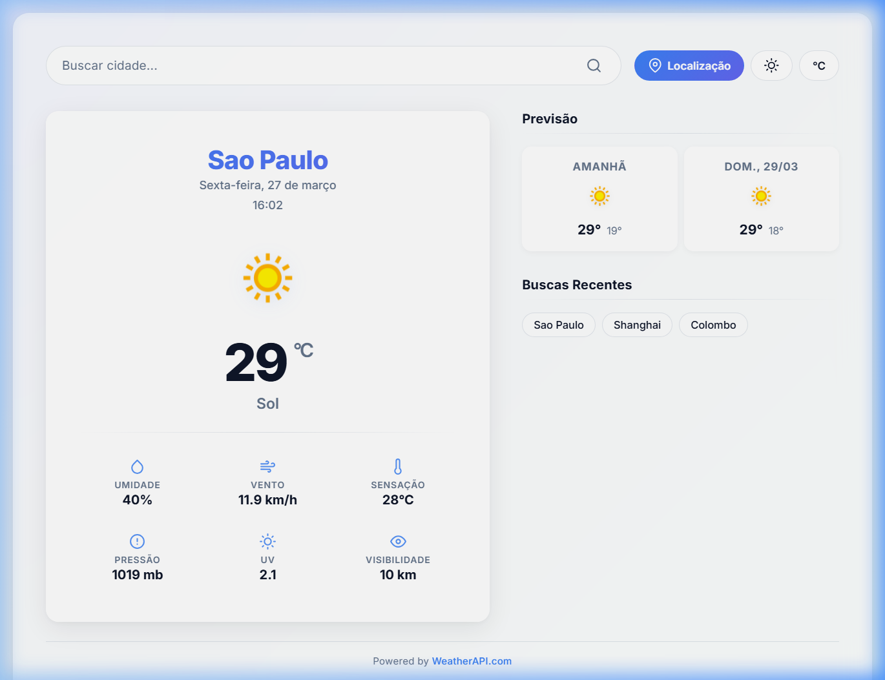
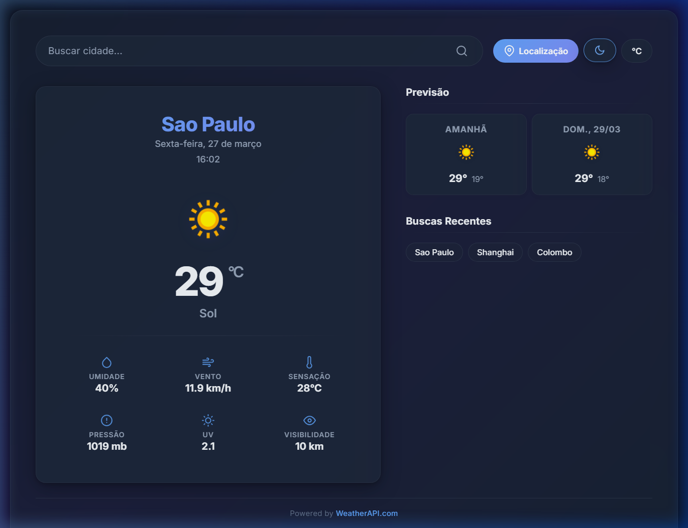

<div align="center">

# ⛅ Atmos360

**App de previsão do tempo com dados em tempo real, interface glassmorphism e tema escuro.**


### 🌍 [Acesse o Projeto Online Aqui](https://atmos360weather.vercel.app/)

[Funcionalidades](#-funcionalidades) · [Screenshots](#-screenshots) · [Como Usar](#-como-usar) · [Arquitetura](#-arquitetura) · [Aprendizados](#-aprendizados)

</div>

---

## 📸 Screenshots

<div align="center">

| Light Mode | Dark Mode |
|---|---|
|  |  |

</div>

---

## ✨ Funcionalidades

- 🔍 **Busca por cidade** — Pesquise qualquer cidade do mundo com sanitização de input.
- 📍 **Geolocalização** — Use sua localização atual com um clique.
- 🌡️ **Clima em tempo real** — Temperatura, umidade, vento, sensação térmica, pressão, UV e visibilidade.
- 📅 **Previsão de 3 dias** — Cards com temperatura máxima/mínima e ícones dinâmicos.
- 🌙 **Dark Mode** — Alternância suave com persistência no localStorage.
- 🔄 **Celsius / Fahrenheit** — Troca instantânea de unidade sem nova chamada à API (Gerenciamento de Estado).
- 🕘 **Buscas recentes** — Histórico das últimas 5 cidades (tags clicáveis persistidas no navegador).
- 💎 **Glassmorphism** — Interface com efeito vidro, blur e transparências.
- 📱 **Responsivo** — Layout adaptativo de mobile a desktop.
- ⚡ **Animações** — Entrada em fade, ícone flutuante e micro-interações em hover.

---

## 🚀 Como Usar

### Pré-requisitos

- [Node.js](https://nodejs.org/) (v18+)
- Uma chave gratuita da [WeatherAPI](https://www.weatherapi.com/)

### Instalação

```bash
# Clone o repositório
git clone https://github.com/seu-usuario/atmos360-weather.git

# Acesse a pasta
cd atmos360-weather

# Instale as dependências
npm install
```

### Configuração

Crie um arquivo `.env` na raiz:

```env
VITE_API_KEY=sua_chave_aqui
```

### Executando

```bash
npm run dev
```

Acesse `http://localhost:5173` no navegador.

---

## 🏗️ Arquitetura

```
src/
├── main.js                 → Orquestra inicialização e eventos
├── components/             → Interação do usuário
│   ├── barraPesquisa.js    → Formulário de busca
│   ├── localizacao.js      → Geolocalização via browser API
│   ├── recentes.js         → Histórico de buscas (localStorage)
│   ├── toggleDarkMode.js   → Tema claro/escuro
│   └── toggleUnidade.js    → °C ↔ °F
├── services/               → Camada de dados
│   ├── api.js              → Fetch para WeatherAPI
│   └── storage.js          → Leitura/escrita no localStorage
├── utils/                  → Renderização
│   ├── climaAtual.js       → Card do clima atual (14 elementos DOM)
│   └── previsao.js         → Cards de previsão (DocumentFragment)
└── styles/                 → CSS modular com design tokens
    ├── variables.css        → Custom properties (light + dark)
    ├── global.css           → Reset, layout, animações, breakpoints
    ├── header.css           → Search box e botões
    ├── clima-atual.css      → Card principal
    ├── painel-lateral.css   → Sidebar (previsão + histórico)
    └── footer.css           → Rodapé
```

### Comunicação entre Módulos

Os componentes são desacoplados via **CustomEvents**:

```
recentes.js      ──► buscaHistorico   ──► main.js
toggleUnidade.js ──► mudouUnidade     ──► main.js
localizacao.js   ──► buscaLocalizacao ──► main.js
```

Isso permite que cada componente funcione de forma independente — o `main.js` atua como mediador central.

---

## 🎨 Design

### Glassmorphism

A interface usa efeito vidro (glass) com:
- Backgrounds semi-transparentes (`rgba`)
- `backdrop-filter: blur(20px)`
- Bordas suaves com transparência
- Sombras em múltiplas camadas

### Design Tokens

Todas as cores, espaçamentos e transições são centralizados em CSS custom properties. O dark mode funciona apenas sobrescrevendo essas variáveis — zero duplicação de código.

### Responsividade

| Breakpoint | Layout |
|---|---|
| Mobile (`< 480px`) | Coluna única, grid 2x3 nos detalhes |
| Tablet (`≥ 768px`) | Container expandido |
| Desktop (`≥ 1024px`) | 2 colunas: clima + sidebar |

---

## 📚 Aprendizados

Este projeto foi desenvolvido para praticar e consolidar:

- **Consumo de API REST** com `fetch` e tratamento de erros
- **ES Modules** — Organização com `import/export` sem frameworks
- **CustomEvents** — Comunicação desacoplada entre componentes
- **CSS Custom Properties** — Sistema de design tokens para temas
- **Glassmorphism** — Técnica visual moderna com `backdrop-filter`
- **localStorage** — Persistência de preferências e histórico
- **Geolocation API** — Acesso à localização do navegador
- **Intl API** — Formatação de datas e tempo relativo em pt-BR
- **Vite** — Setup de build moderno para projetos vanilla

---

## 🛠️ Feito com

- [Vite](https://vitejs.dev/) — Build tool
- [WeatherAPI](https://www.weatherapi.com/) — Dados meteorológicos
- [Google Fonts (Inter)](https://fonts.google.com/specimen/Inter) — Tipografia
- [Feather Icons](https://feathericons.com/) — Ícones SVG inline

---

<div align="center">

Feito por **Vitor Felipe** 🚀

</div>

# Instale as dependências
npm install
